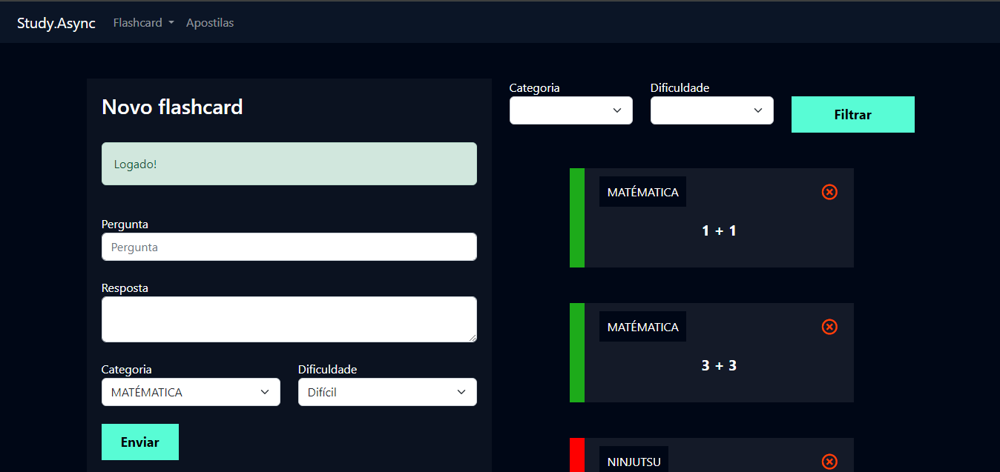
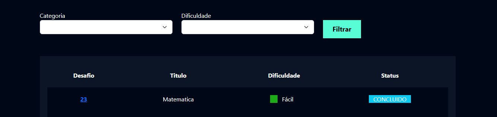
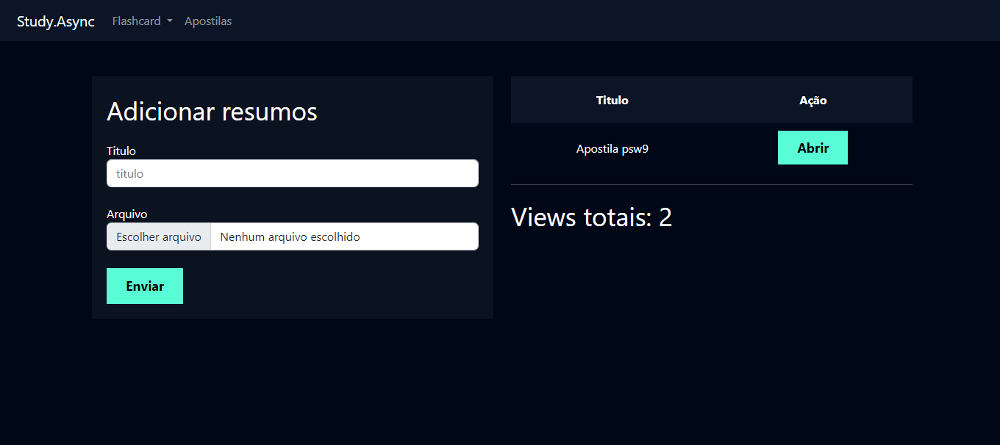

# Study.Async

Study.Async é uma plataforma de estudos individuais com o  auxilio de flashcards. Com ela é possível criar desafios, anexar apostilas e muito mais.
## Autores 👨‍💻👨‍🏫
Projeto desenvolvido na [PYSTACK WEEK 9.0](https://www.youtube.com/@pythonando).
## Ano 📅
2024
### Capturas de tela 📸

#### Login

#### Flashcards

#### Desafios
>

#### Apostilas
>

## Tecnologias Utilizadas

-  Js
-  css
-  Django
-  Python

